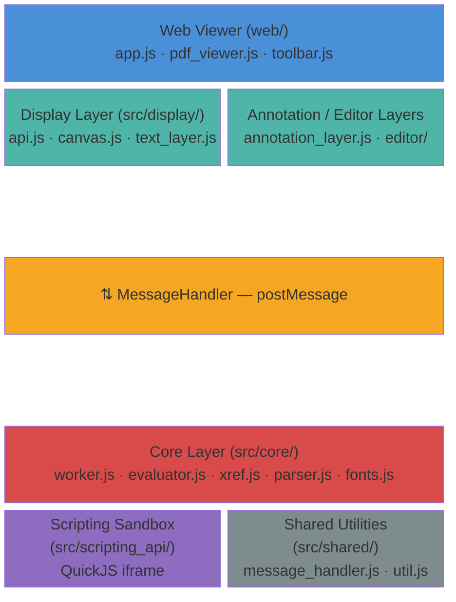
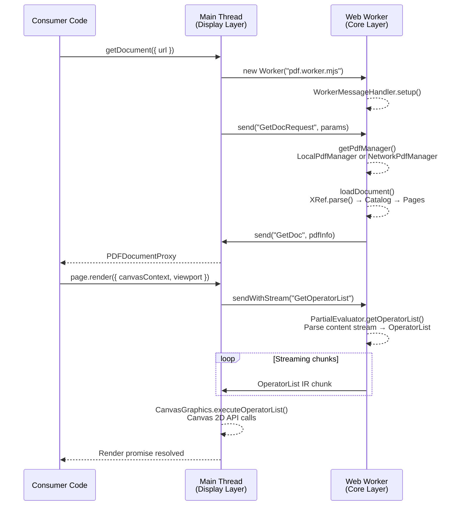
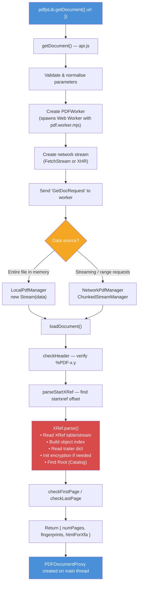
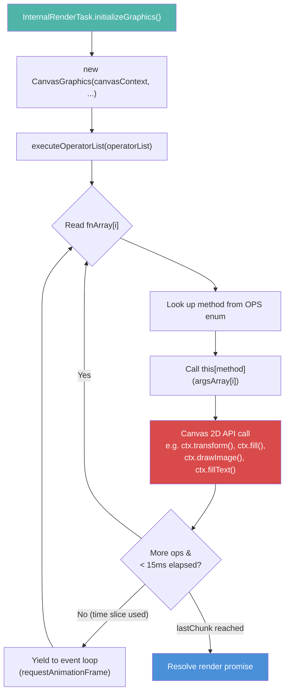

# PDF.js Codebase Analysis

## 1. High-Level Architectural Overview

PDF.js is a client-side PDF rendering engine built entirely in JavaScript. It uses a **multi-threaded architecture** that separates heavy PDF parsing from the main browser thread, communicating over a structured message protocol.

### Layer Diagram

### The Five Layers

#### 1.1 Core Layer (`src/core/`)

Runs inside a **Web Worker** (or inline in Node.js). Responsible for all binary PDF parsing:

- **`worker.js`** -- `WorkerMessageHandler` is the entry point. It receives messages from the display layer, creates a `PdfManager`, and dispatches handler functions for every document operation (`GetPage`, `GetAnnotations`, `GetTextContent`, `SaveDocument`, etc.).
- **`pdf_manager.js`** -- Two implementations: `LocalPdfManager` (entire file in memory) and `NetworkPdfManager` (range-request / chunked streaming via `ChunkedStreamManager`). Both wrap a `PDFDocument` instance.
- **`document.js`** -- `PDFDocument` owns the `XRef` table, `Catalog`, and page tree. `Page` objects create `PartialEvaluator` instances to convert page content streams into operator lists.
- **`xref.js`** -- `XRef` reads cross-reference tables (both traditional table format and compressed XRef streams) to locate every indirect object in the file. Supports recovery mode for corrupt files.
- **`evaluator.js`** -- `PartialEvaluator` is the largest single file (~5500 lines). It walks a page's content stream, resolves resources (fonts, images, colour spaces, patterns), and emits an `OperatorList` -- a serialisable array of drawing commands.
- **`operator_list.js`** -- `OperatorList` is the serialised command buffer. It includes a `QueueOptimizer` that coalesces repetitive sequences (e.g. batching inline images, repeated image masks, and repeated text blocks) before transmitting to the main thread.
- **`parser.js` / `primitives.js`** -- Low-level PDF object model: `Dict`, `Name`, `Ref`, `Cmd`, streams. `Lexer` and `Parser` tokenise the PDF syntax.
- **`writer.js`** -- Performs **incremental updates** when saving modified documents (form fills, annotation edits). Appends new/changed objects and a new XRef section to the original byte array.
- **Font engine** (`fonts.js`, `cff_parser.js`, `type1_parser.js`, `font_renderer.js`, `glyf.js`, `opentype_file_builder.js`) -- Parses CFF, TrueType, Type1 fonts, converts them to OpenType for the browser's Font Loading API, and provides a fallback glyph path renderer.
- **Image decoders** (`jpg.js`, `jpx.js`, `jbig2.js`) -- Pure-JS decoders for JPEG, JPEG2000, and JBIG2, with optional WebAssembly acceleration (`external/openjpeg/`, `external/jbig2/`).
- **XFA subsystem** (`xfa/`) -- Parses XML Forms Architecture documents into a virtual DOM that can be rendered by the display layer.

#### 1.2 Display Layer (`src/display/`)

Runs on the **main thread**. Provides the public API and rendering engine:

- **`api.js`** -- The public surface. `getDocument()` bootstraps a worker, returns a `PDFDocumentLoadingTask` that resolves to `PDFDocumentProxy`. Each page is a `PDFPageProxy` whose `.render()` method drives painting.
- **`canvas.js`** -- `CanvasGraphics` consumes an `OperatorList` and translates each op (`OPS.*`) into HTML5 Canvas 2D calls (`fillRect`, `drawImage`, `bezierCurveTo`, etc.). Runs in timed slices (15 ms) to avoid blocking the UI.
- **`text_layer.js`** -- Creates invisible, precisely positioned `` elements over the canvas so that users can select and search text.
- **`annotation_layer.js`** -- Renders interactive PDF annotations (links, form fields, popups) as DOM elements on top of the canvas.
- **`editor/`** -- Annotation editing UI: freetext, ink, highlight, stamp, and signature tools that write back to `AnnotationStorage`.
- **Network streams** (`fetch_stream.js`, `network.js`, `node_stream.js`) -- Abstraction over Fetch API / XHR / Node.js streams for downloading PDF data, including range-request support for partial loading.
- **`worker_options.js`** -- `GlobalWorkerOptions` lets the consumer specify a custom `workerSrc` or `workerPort`.

#### 1.3 Shared Utilities (`src/shared/`)

Used by both core and display layers:

- **`message_handler.js`** -- `MessageHandler` wraps `postMessage` into a typed RPC protocol: fire-and-forget (`send`), request/response (`sendWithPromise`), and streaming (`sendWithStream` / `StreamSink`). Handles back-pressure via `ReadableStream`.
- **`util.js`** -- Constants (`OPS`, `AnnotationType`, `ImageKind`), error types (`InvalidPDFException`, `PasswordException`), and shared helpers.

#### 1.4 Scripting Layer (`src/scripting_api/`)

Implements the Acrobat JavaScript API (App, Doc, Field, Event, etc.) for interactive PDFs with form calculations and button actions. Runs in a **sandboxed iframe** (`pdf.sandbox.js`) powered by QuickJS (`external/quickjs/`).

#### 1.5 Web Viewer (`web/`)

A complete reference PDF viewer application:

- `app.js` orchestrates the viewer lifecycle.
- `pdf_viewer.js` / `pdf_page_view.js` manage page layout, scrolling, and lazy rendering.
- UI components: toolbar, sidebar (thumbnails, outline, attachments), find bar, presentation mode, print service.
- Platform-specific adapters: `firefoxcom.js` (Firefox built-in), `chromecom.js` (Chrome extension), `genericcom.js` (standalone web).
- Localisation via Fluent (`.ftl` files in `l10n/`).

### Worker Communication Flow

---

## 2. Build and Packaging Flow

### 2.1 Build System Overview

The build is orchestrated by **Gulp** (`gulpfile.mjs`) using **Webpack 5** for module bundling and **Babel** for optional transpilation.

### 2.2 The `generic` Build (Primary Target)

`npx gulp generic` runs the following **serial** pipeline:

1. **`createBuildNumber`** -- Runs `git log` to count commits since `baseVersion` (from `pdfjs.config`), writes `build/version.json` with `{ version, build, commit }`.

2. **`locale`** -- Copies Fluent `.ftl` translation files from `l10n/` into `web/locale/` and generates a `locale.json` index.

3. **`scriptingGeneric`** -- Webpack bundles `src/pdf.scripting.js` into a temporary file (`build/tmp/pdf.scripting.mjs`), then discards it after the sandbox bundle consumes it.

4. **`createGeneric`** -- `buildGeneric()` produces the full output in `build/generic/`:

   | Output | Source entry point | Description |
   |---|---|---|
   | `build/pdf.mjs` | `src/pdf.js` | Main library (display layer API) |
   | `build/pdf.worker.mjs` | `src/pdf.worker.js` | Worker thread (core layer) |
   | `build/pdf.sandbox.mjs` | `src/pdf.sandbox.js` | Scripting sandbox (embeds `pdf.scripting.mjs` as an eval'd string) |
   | `web/viewer.mjs` | `web/viewer.js` | Viewer application |
   | `web/viewer.html` | `web/viewer.html` | Preprocessed HTML |
   | `web/viewer.css` | `web/viewer.css` | PostCSS-processed stylesheet |
   | `web/cmaps/` | `external/bcmaps/` | Binary CMap files for CJK fonts |
   | `web/iccs/` | `external/iccs/` | ICC colour profiles |
   | `web/standard_fonts/` | `external/standard_fonts/` | Core 14 PDF font files |
   | `web/wasm/` | `external/openjpeg/`, `external/qcms/`, `external/jbig2/` | WebAssembly modules for image/colour decoding |

### 2.3 Webpack Configuration

`createWebpackConfig()` builds a Webpack config for each bundle:

- **Mode**: `production` (no minification unless `MINIFIED` define is set).
- **Preprocessor**: A custom Babel plugin (`babelPluginPDFJSPreprocessor`) evaluates `PDFJSDev.test("GENERIC")` guards at compile time, stripping dead code for each build target.
- **Defines**: Build-time constants (`GENERIC`, `MOZCENTRAL`, `CHROME`, `MINIFIED`, `TESTING`, `LIB`, etc.) control conditional compilation. For the generic build, `GENERIC: true` and `SKIP_BABEL: true` (no Babel transpilation for modern browsers).
- **Aliases**: `createWebpackAlias()` maps abstract module names (e.g. `"display-network_stream"`, `"web-download_manager"`) to concrete files depending on the build target. This is how the same source code produces different builds for Firefox, Chrome, and generic web.
- **Output**: ESM modules (`.mjs`, `library.type: "module"`).
- **Source maps**: Enabled for generic/components builds, disabled for MOZCENTRAL/CHROME/MINIFIED.

### 2.4 CSS Processing

Viewer CSS goes through a PostCSS pipeline:
1. `postcss-dir-pseudo-class` -- polyfills `:dir()` pseudo-class.
2. `postcss-discard-comments` -- strips comments (preserving the first license header).
3. `postcss-nesting` -- compiles CSS nesting.
4. `@csstools/postcss-light-dark-function` -- polyfills `light-dark()`.
5. `autoprefixer` -- adds vendor prefixes.

### 2.5 Other Build Targets

| Gulp task | Description |
|---|---|
| `generic-legacy` | Same as `generic` but with `SKIP_BABEL: false` -- Babel transpiles to older browser targets. |
| `minified` / `minified-legacy` | Bundles with Terser minification. |
| `components` / `components-legacy` | Exports `PDFViewer` as a reusable component (`pdf_viewer.mjs` + CSS). |
| `mozcentral` | Firefox integration build -- different aliases, no source maps, generates `PdfJsDefaultPrefs.js`. |
| `chromium` | Chrome extension build. |
| `dist` | Creates the `pdfjs-dist` npm package in `build/dist/`. |
| `image_decoders` | Standalone image decoder bundle (JPEG, JPEG2000, JBIG2). |
| `lib` / `lib-legacy` | CommonJS/ESM library builds for Node.js consumption. |

### 2.6 Testing Infrastructure

| Gulp task | Description |
|---|---|
| `lint` | ESLint + Stylelint + SVGlint. |
| `unittest` | Browser-based Jasmine unit tests (via Puppeteer). |
| `unittestcli` | Same unit tests in Node.js (some tests skipped -- DOM/Worker APIs unavailable). |
| `integrationtest` | Puppeteer-driven integration tests. |
| `fonttest` | Font-specific tests. |
| `test` | Full browser test suite (includes visual regression via reference images). |
| `typestest` | TypeScript type-checking of generated `.d.ts` files. |

---

## 3. How PDF Rendering Works End-to-End

> **Important clarification**: PDF.js is a PDF **parser and renderer**, not a PDF **generator**. It reads existing PDF files and renders them to screen. It does not create PDF documents from scratch. The "generation" aspect is limited to incremental updates when saving form data or annotation edits back to an existing PDF. This section describes the full rendering pipeline.

### 3.1 Document Loading

### 3.2 Page Rendering

When the consumer calls `page.render({ canvasContext, viewport })`:

#### Step 1: Request the Operator List

The main thread sends a `GetOperatorList` streaming request to the worker. The worker:

1. **Fetches page content stream**: `Page.getContentStream()` reads the `/Contents` entry.
2. **Loads resources**: Fonts, colour spaces, ExtGState dictionaries referenced by the page.
3. **Creates a `PartialEvaluator`** for this page.
4. **Walks the content stream**: `PartialEvaluator.getOperatorList()` reads PDF operators one by one from the `Parser`:

   - **Graphics state ops** (`q`, `Q`, `cm`, `w`, `J`, etc.) -> mapped to `OPS.save`, `OPS.restore`, `OPS.transform`, etc.
   - **Path ops** (`m`, `l`, `c`, `re`, `h`) -> `OPS.constructPath` (batched).
   - **Paint ops** (`S`, `f`, `B`, etc.) -> `OPS.stroke`, `OPS.fill`, `OPS.fillStroke`.
   - **Text ops** (`BT`, `Tf`, `Tm`, `Tj`, `TJ`, `ET`) -> `OPS.beginText`, `OPS.setFont`, `OPS.showText`, `OPS.endText`. Font loading is triggered here: the evaluator parses/converts fonts, sends them to the main thread as `FontFaceObject` instances.
   - **Image ops** (`BI`/`ID`/`EI` for inline, `Do` for XObject) -> `OPS.paintImageXObject` / `OPS.paintInlineImageXObject`. Images are decoded (JPEG/JPEG2000/JBIG2) and pixel data is sent to the main thread.
   - **Colour ops** (`cs`, `CS`, `sc`, `SC`, `g`, `rg`, `k`, etc.) -> `OPS.setFillRGBColor`, `OPS.setStrokeRGBColor`, etc. Colour spaces are resolved and colours converted to RGB.
   - **Shading/Pattern ops** (`sh`, `SCN` with patterns) -> `OPS.shadingFill`, `OPS.setFillColorN`.

5. **`QueueOptimizer`** coalesces repeated operations (e.g. many small inline images become one `paintInlineImageXObjectGroup`).

6. **Operator list chunks are streamed** to the main thread as they are produced, enabling progressive rendering.

#### Step 2: Render Annotations

In parallel, the worker resolves page annotations (`Page._parsedAnnotations`). Each annotation is serialised and sent to the main thread. The annotation operator lists are appended to the page's operator list if rendering with annotations enabled.

#### Step 3: Canvas Painting

On the main thread, `CanvasGraphics` (`canvas.js`) consumes the operator list:

Key rendering details:
- **Fonts**: Converted to OpenType by the core layer, loaded via `FontFaceObject` / Font Loading API on the main thread. If `disableFontFace` is set, a fallback path renderer draws glyphs using canvas path commands.
- **Images**: Decoded to raw pixel data in the worker. Transferred to main thread. `putBinaryImageData()` writes pixels to canvas in chunks to manage memory.
- **Transparency groups**: Handled via off-screen canvases (`beginGroup`/`endGroup`), composited with appropriate blend modes.
- **Soft masks (SMask)**: Rendered to separate canvases and applied as alpha masks during compositing.
- **Tiling patterns**: Rendered to a small canvas tile, then used as a `CanvasPattern` via `ctx.createPattern()`.

#### Step 4: Additional Layers

After canvas rendering, additional DOM layers are constructed:

- **Text layer** (`TextLayer`): `page.getTextContent()` returns positioned text items. `TextLayer.render()` creates `` elements with CSS transforms matching the PDF text positions, enabling copy/paste and Ctrl+F.
- **Annotation layer** (`AnnotationLayer`): Creates HTML elements for links, form fields, popups, etc. Interactive form fields sync with `AnnotationStorage`.
- **XFA layer**: For pure XFA documents, renders the XFA virtual DOM as HTML instead of using canvas.

### 3.3 Saving / Incremental Update (the only "PDF generation")

When a user fills in a form or edits annotations and the document is saved:

1. `PDFDocumentProxy.saveDocument()` sends changed annotations from `AnnotationStorage` to the worker.
2. The worker calls `Page.save()` for each affected page, which serialises annotation changes.
3. `writer.js` -> `incrementalUpdate()` appends modified/new objects and a new XRef section to the **original PDF byte array**. This is a standard PDF incremental update -- the original file is preserved intact.
4. The resulting `Uint8Array` is returned to the main thread for download.

This is **not** PDF creation from scratch -- it is an append-only modification of an existing PDF file.

### 3.4 Areas of Uncertainty

- **WebGPU rendering path** (`display/webgpu.js`): There is an `initGPU()` function and an `enableWebGPU` parameter, suggesting early-stage or experimental WebGPU hardware acceleration. The extent of its implementation and how far along it is is uncertain from code inspection alone.
- **`obj_bin_transform_core.js` / `obj_bin_transform_display.js`**: These appear to be a binary serialisation optimisation for transferring font path and pattern data between worker and main thread. The exact scope and recency of this system is unclear.
- **Linearization / "Fast Web View"**: The `Linearization` class in `parser.js` can parse linearization dictionaries, and `NetworkPdfManager` supports range requests. However, how completely linearized PDFs are exploited for streaming first-page display (versus simply falling back to full download) is not fully clear from static analysis.
