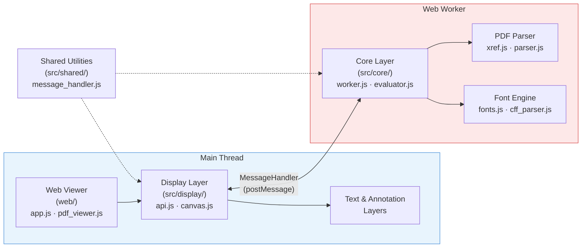

# PDF.js [](https://github.com/mozilla/pdf.js/actions/workflows/ci.yml?query=branch%3Amaster) [](https://codecov.io/gh/mozilla/pdf.js)

[PDF.js](https://mozilla.github.io/pdf.js/) is a Portable Document Format (PDF) viewer that is built with HTML5.

PDF.js is community-driven and supported by Mozilla. Our goal is to
create a general-purpose, web standards-based platform for parsing and
rendering PDFs.

## How It Works Internally

PDF.js uses a **multi-threaded architecture** that offloads heavy PDF parsing to a Web Worker, keeping the main browser thread responsive for rendering and user interaction.

### Architecture at a Glance



### The Five Layers

| Layer | Location | Thread | Purpose |
|---|---|---|---|
| **Core** | `src/core/` | Worker | Binary PDF parsing, font decoding, image decoding, XRef resolution, content stream evaluation |
| **Display** | `src/display/` | Main | Public API (`getDocument`, `PDFPageProxy.render`), Canvas/WebGL rendering, network streams |
| **Shared** | `src/shared/` | Both | `MessageHandler` (worker RPC protocol), constants (`OPS`), error types, utility functions |
| **Scripting** | `src/scripting_api/` | Sandboxed iframe | Acrobat JavaScript API for interactive form calculations and button actions (powered by QuickJS) |
| **Web Viewer** | `web/` | Main | Reference viewer application — toolbar, sidebar, find bar, print, and platform-specific adapters |

### Key Concepts

Understanding these concepts is essential before diving into the codebase:

- **OperatorList**: The central data structure. The worker parses PDF content streams and emits a serialised array of drawing commands (e.g. `OPS.fill`, `OPS.showText`, `OPS.paintImageXObject`). This is streamed to the main thread in chunks for progressive rendering.
- **PartialEvaluator** (`src/core/evaluator.js`): The largest and most complex file (~5,500 lines). It walks a page's content stream, resolves all resources (fonts, images, colour spaces, patterns), and produces the OperatorList.
- **MessageHandler** (`src/shared/message_handler.js`): Wraps `postMessage` into a typed RPC protocol with three modes: fire-and-forget (`send`), request/response (`sendWithPromise`), and streaming with back-pressure (`sendWithStream`).
- **XRef** (`src/core/xref.js`): Reads PDF cross-reference tables and streams to build an index of every object in the file. Supports recovery mode for corrupt PDFs.
- **PDFJSDev preprocessor**: A custom Babel plugin that evaluates `PDFJSDev.test("GENERIC")` guards at compile time, stripping dead code per build target. This is how one codebase produces different builds for Firefox, Chrome, and generic web.
- **Webpack aliases**: `createWebpackAlias()` in `gulpfile.mjs` maps abstract module names (e.g. `"display-network_stream"`) to concrete files depending on the build target.

### Rendering Flow (Simplified)

1. **`getDocument({ url })`** — bootstraps a Web Worker, sends the PDF data to the core layer
2. **Worker parses the PDF** — reads the XRef table, locates the page tree, validates the header
3. **`page.render()`** — main thread requests an OperatorList via a streaming message
4. **PartialEvaluator walks the content stream** — converts PDF operators to `OPS.*` commands, loads fonts, decodes images
5. **OperatorList chunks stream back** — enabling progressive rendering before the full page is parsed
6. **CanvasGraphics paints to canvas** — executes each op as Canvas 2D API calls in timed 15ms slices to avoid blocking the UI
7. **Text and annotation layers** — invisible `<span>` elements (for text selection/search) and DOM elements (for links, forms) are overlaid on the canvas

For a detailed end-to-end walkthrough, see [ANALYSIS.md](ANALYSIS.md).

---

## Contributing

PDF.js is an open source project and always looking for more contributors. To
get involved, visit:

+ [Issue Reporting Guide](https://github.com/mozilla/pdf.js/blob/master/.github/CONTRIBUTING.md)
+ [Code Contribution Guide](https://github.com/mozilla/pdf.js/wiki/Contributing)
+ [Frequently Asked Questions](https://github.com/mozilla/pdf.js/wiki/Frequently-Asked-Questions)
+ [Good Beginner Bugs](https://github.com/mozilla/pdf.js/issues?q=is%3Aissue%20state%3Aopen%20label%3Agood-beginner-bug)
+ [Projects](https://github.com/mozilla/pdf.js/projects)

Feel free to stop by our [Matrix room](https://chat.mozilla.org/#/room/#pdfjs:mozilla.org) for questions or guidance.

### Contributor Guide: Approaching Changes

This codebase has a number of conventions and patterns that contributors should be aware of before making changes.

#### Source Organisation

```
src/
├── core/           # Worker thread — PDF parsing, fonts, images (DO NOT import display/ here)
├── display/        # Main thread — API, canvas rendering, network streams (DO NOT import core/ here)
├── shared/         # Shared between both threads — the ONLY code that can be imported by both
├── scripting_api/  # Acrobat JS sandbox — isolated, communicates via events only
├── pdf.js          # Display layer entry point (bundled as pdf.mjs)
└── pdf.worker.js   # Core layer entry point (bundled as pdf.worker.mjs)
web/                # Viewer application — consumes src/display/ API only
```

**Thread boundary rule**: Code in `src/core/` runs in a Web Worker and **must not** import from `src/display/` (or vice versa). All cross-thread communication goes through `MessageHandler` in `src/shared/`. Violating this will cause runtime errors in browser environments.

#### Build-Time Conditional Compilation

The codebase uses a preprocessor (`PDFJSDev`) to strip code at build time:

```javascript
// This block is removed entirely in MOZCENTRAL builds:
if (typeof PDFJSDev === "undefined" || PDFJSDev.test("GENERIC")) {
  // generic-only code
}
```

Common defines: `GENERIC`, `MOZCENTRAL`, `CHROME`, `MINIFIED`, `TESTING`, `LIB`, `SKIP_BABEL`. When adding platform-specific code, wrap it in the appropriate guard.

#### Development Workflow

```bash
# Start development server (auto-rebuilds on file changes)
npx gulp server
# Open http://localhost:8888/web/viewer.html

# Run linting (ESLint + Stylelint + SVGlint)
npx gulp lint

# Run unit tests in Node.js (no browser needed)
npx gulp unittestcli

# Run browser-based unit tests (requires Puppeteer)
npx gulp unittest

# Run integration tests
npx gulp integrationtest

# Build the generic viewer
npx gulp generic

# Build for Firefox integration
npx gulp mozcentral
```

#### Tips for Common Change Types

| What you want to change | Where to look | What to watch out for |
|---|---|---|
| Fix a rendering bug | `src/core/evaluator.js` (OperatorList generation) or `src/display/canvas.js` (Canvas painting) | Changes to the evaluator affect all build targets; test with diverse PDFs |
| Add/fix annotation support | `src/core/annotation.js` + `src/display/annotation_layer.js` | Annotations span both threads — core serialises, display renders |
| Modify the viewer UI | `web/` directory | Use the `PDFJSDev` preprocessor for platform-specific UI; respect the Fluent localisation system (`l10n/`) |
| Fix a font rendering issue | `src/core/fonts.js`, `cff_parser.js`, `type1_parser.js`, `font_renderer.js` | The font engine converts to OpenType for the browser; fallback path rendering exists for `disableFontFace` |
| Adjust the build pipeline | `gulpfile.mjs` | Webpack aliases change per build target — test all affected targets, not just `generic` |
| Add a new PDF operator | `src/core/evaluator.js` (parsing) + `src/display/canvas.js` (rendering) + `src/shared/util.js` (add `OPS` constant) | Must update all three locations; add unit tests in `test/unit/` |
| Modify worker ↔ main thread communication | `src/shared/message_handler.js` | Both sides must agree on the message format; changes here affect every build target |

#### Testing Expectations

- **Unit tests**: `test/unit/` — Jasmine specs. Run with `npx gulp unittestcli` (Node.js) or `npx gulp unittest` (browser). Some tests are skipped in CLI mode due to missing DOM/Worker APIs — this is expected.
- **Integration tests**: `test/integration/` — Puppeteer-driven browser tests.
- **Visual regression**: The `test` gulp task compares rendered output against reference images. If your change affects rendering, you may need to update reference snapshots.
- **Type checking**: `npx gulp typestest` verifies the generated TypeScript declarations.
- **Linting**: `npx gulp lint` runs ESLint, Stylelint, and SVGlint. Always pass lint before submitting.

---

## Getting Started

### Online demo

Please note that the "Modern browsers" version assumes native support for the
latest JavaScript features; please also see [this wiki page](https://github.com/mozilla/pdf.js/wiki/Frequently-Asked-Questions#faq-support).

+ Modern browsers: https://mozilla.github.io/pdf.js/web/viewer.html

+ Older browsers: https://mozilla.github.io/pdf.js/legacy/web/viewer.html

### Browser Extensions

#### Firefox

PDF.js is built into version 19+ of Firefox.

#### Chrome

+ The official extension for Chrome can be installed from the [Chrome Web Store](https://chrome.google.com/webstore/detail/pdf-viewer/oemmndcbldboiebfnladdacbdfmadadm).
*This extension is maintained by [@Rob--W](https://github.com/Rob--W).*
+ Build Your Own - Get the code as explained below and issue `npx gulp chromium`. Then open
Chrome, go to `Tools > Extension` and load the (unpackaged) extension from the
directory `build/chromium`.

### PDF debugger

Browser the internal structure of a PDF document with https://mozilla.github.io/pdf.js/internal-viewer/web/debugger.html

## Getting the Code

To get a local copy of the current code, clone it using git:

    $ git clone https://github.com/mozilla/pdf.js.git
    $ cd pdf.js

Next, install Node.js via the [official package](https://nodejs.org) or via
[nvm](https://github.com/creationix/nvm). You need **Node.js >=22.13.0** (or >=24). If everything worked out, install
all dependencies for PDF.js:

    $ npm install

Finally, you need to start a local web server as some browsers do not allow opening
PDF files using a `file://` URL. Run:

    $ npx gulp server

and then you can open:

+ http://localhost:8888/web/viewer.html

Please keep in mind that this assumes the latest version of Mozilla Firefox; refer to [Building PDF.js](https://github.com/mozilla/pdf.js/blob/master/README.md#building-pdfjs) for non-development usage of the PDF.js library.

It is also possible to view all test PDF files on the right side by opening:

+ http://localhost:8888/test/pdfs/?frame

## Building PDF.js

In order to bundle all `src/` files into two production scripts and build the generic
viewer, run:

    $ npx gulp generic

If you need to support older browsers, run:

    $ npx gulp generic-legacy

This will generate `pdf.mjs` and `pdf.worker.mjs` in the `build/generic/build/` directory (respectively `build/generic-legacy/build/`).
Both scripts are needed but only `pdf.mjs` needs to be included since `pdf.worker.mjs` will
be loaded by `pdf.mjs`. The PDF.js files are large and should be minified for production.

Other build targets are available for specific platforms and use cases:

| Command | Description |
|---|---|
| `npx gulp generic` | Standard build for modern browsers (ESM, no transpilation) |
| `npx gulp generic-legacy` | Same, but with Babel transpilation for older browsers |
| `npx gulp minified` | Terser-minified bundle for production |
| `npx gulp components` | Exports `PDFViewer` as a reusable component |
| `npx gulp mozcentral` | Firefox integration build (different aliases, no source maps) |
| `npx gulp chromium` | Chrome extension build |
| `npx gulp dist` | Creates the `pdfjs-dist` npm package in `build/dist/` |
| `npx gulp image_decoders` | Standalone image decoder bundle (JPEG, JPEG2000, JBIG2) |

The build system uses **Gulp** for orchestration, **Webpack 5** for module bundling, and a custom **Babel preprocessor plugin** for build-time conditional compilation. See [ANALYSIS.md](ANALYSIS.md) for a detailed build pipeline breakdown.

## Using PDF.js in a web application

To use PDF.js in a web application you can choose to use a pre-built version of the library
or to build it from source. We supply pre-built versions for usage with NPM under
the `pdfjs-dist` name. For more information and examples please refer to the
[wiki page](https://github.com/mozilla/pdf.js/wiki/Setup-pdf.js-in-a-website) on this subject.

## Including via a CDN

PDF.js is hosted on several free CDNs:
 - https://www.jsdelivr.com/package/npm/pdfjs-dist
 - https://cdnjs.com/libraries/pdf.js
 - https://unpkg.com/pdfjs-dist/

## Learning

You can play with the PDF.js API directly from your browser using the live demos below:

+ [Interactive examples](https://mozilla.github.io/pdf.js/examples/index.html#interactive-examples)

More examples can be found in the [examples folder](https://github.com/mozilla/pdf.js/tree/master/examples/). Some of them are using the pdfjs-dist package, which can be built and installed in this repo directory via `npx gulp dist-install` command.

For an introduction to the PDF.js code, check out the presentation by our
contributor Julian Viereck:

+ https://www.youtube.com/watch?v=Iv15UY-4Fg8

More learning resources can be found at:

+ https://github.com/mozilla/pdf.js/wiki/Additional-Learning-Resources

The API documentation can be found at:

+ https://mozilla.github.io/pdf.js/api/

### Further Reading

For a deep dive into the codebase internals, see [ANALYSIS.md](ANALYSIS.md) which covers:
- Detailed descriptions of each architectural layer and key files
- The complete build pipeline (Gulp → Webpack → Babel preprocessor → PostCSS)
- End-to-end PDF rendering flow with Mermaid diagrams
- Areas of uncertainty in the codebase

## Questions

Check out our FAQs and get answers to common questions:

+ https://github.com/mozilla/pdf.js/wiki/Frequently-Asked-Questions

Talk to us on Matrix:

+ https://chat.mozilla.org/#/room/#pdfjs:mozilla.org

File an issue:

+ https://github.com/mozilla/pdf.js/issues/new/choose
